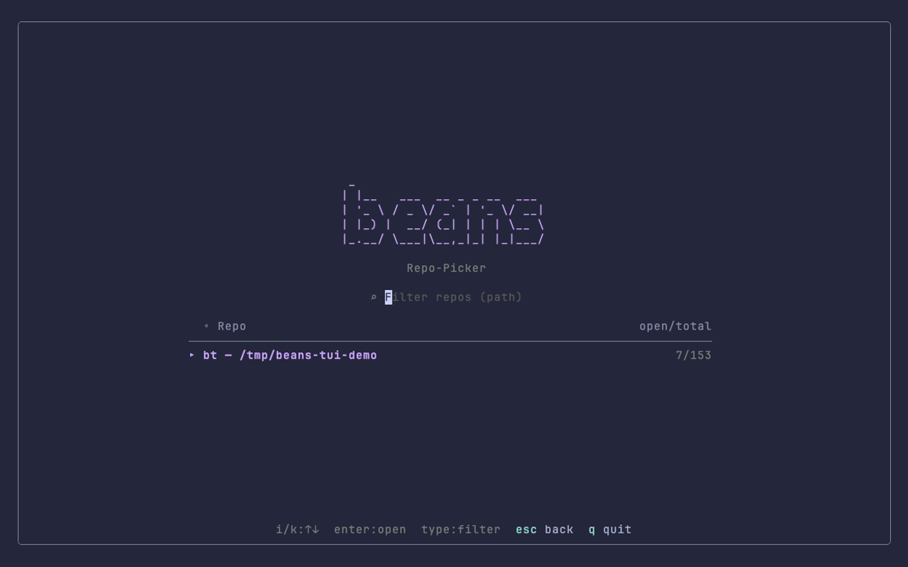
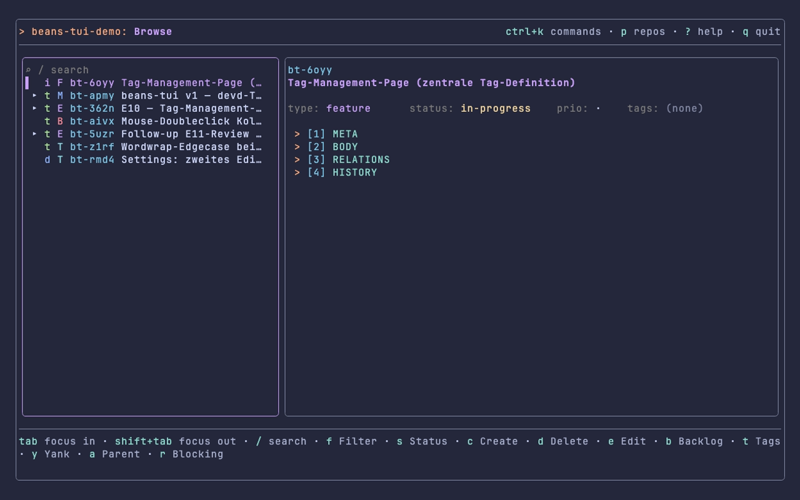
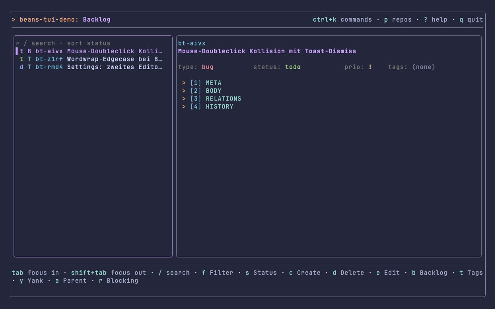
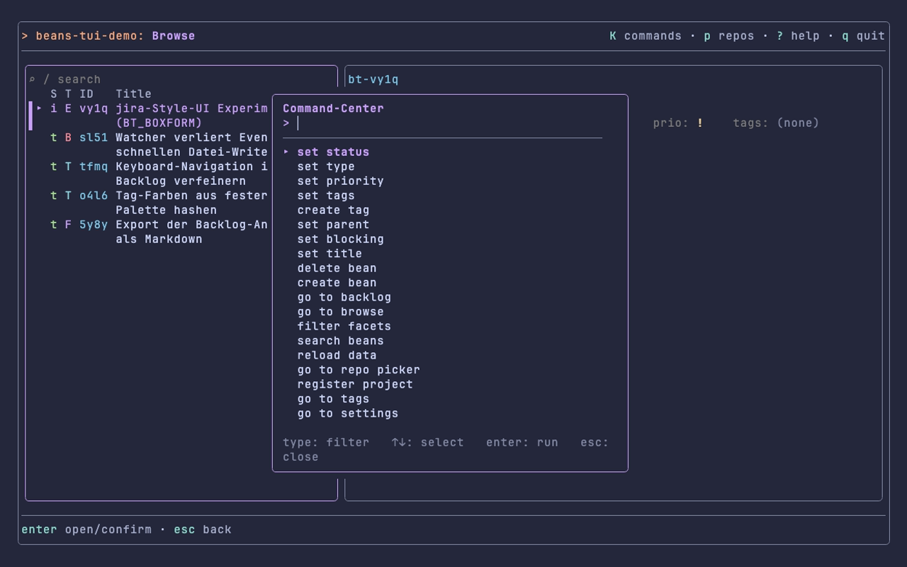
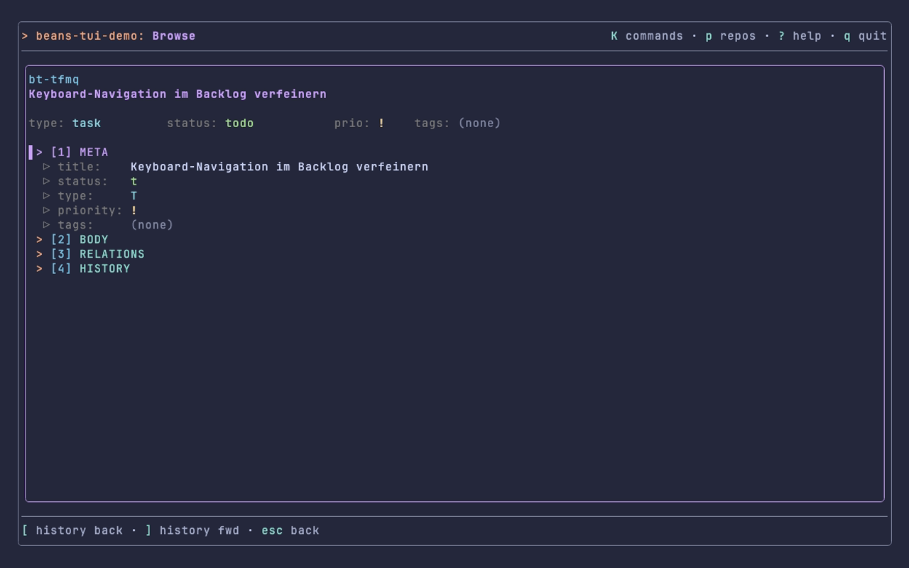

# beans-tui (`bt`)

A keyboard-first, mouse-friendly terminal UI for [beans](https://github.com/hmans/beans)
repos — a fuller-featured PO-cockpit (Product-Owner cockpit) alongside
beans' own bundled `beans tui`, built as a port of a prior DevDash TUI onto
the beans data layer. Design/architecture background:
[`docs/plans/v1-port/design-spec.md`](docs/plans/v1-port/design-spec.md).
Release history: [`CHANGELOG.md`](CHANGELOG.md).

## Features

- **Browse** — live-reloading Tree (Milestones → Epics → Tasks) with a
  master-detail Accordion (Meta/Body/Relations/History), relation-jump
- **Backlog** — flat, sortable view of unscheduled (parentless, todo/draft)
  work
- **Command-Center** (`ctrl+k` / `K`) — fuzzy actions + bean search, mixed
  and context-first
- **Full mutation support** — create/edit/delete, combined Status/Type/
  Priority menu, Tag-/Parent-/Blocking-Picker, `$EDITOR` body edit, all with
  ETag-conflict handling
- **Search** — local live filter (title), full-text via Bleve from 3
  characters (title+body)
- **Facet filter** — Status/Type/Priority/Tag, shared across Tree and
  Backlog
- **Fullscreen** (`v`) — single-pane Detail or List view, with its own
  History-stack (`[`/`]`) for Relations-jumps
- **Lobby / Repo-Picker** (`p`) — switch between multiple beans repos, each
  with its own watcher lifecycle
- **Mouse support** — wheel, click, double-click
- **Tags visible in Detail** — a 5th Meta field (`tags:`), `enter` opens the
  Tag-Picker directly; also filterable via the Filter facette (`f`)
- **Configurable** — editor, accent color, tree width
  (`~/.config/beans-tui/`)

## Experimental: jira-style Detail (`BT_BOXFORM`)

An opt-in, jira-style Detail pane that renders a bean's fields as titled
boxes (Title / Status·Type·Priority / Parent·Tags / Body / Relations /
History) instead of the classic Accordion. **Off by default** — enable per
session with the environment flag:

```sh
BT_BOXFORM=1 bt
```

Highlights when enabled: field-anchored value menus (mouse-native), a
focusable field cursor (`tab`/`shift+tab`), and paged Body scrolling
(`pgup`/`pgdn`) with a sticky Body header carrying a page indicator. With
the flag unset the UI is byte-for-byte the classic Accordion. Design notes:
[`docs/plans/jira-style-experiment/`](docs/plans/jira-style-experiment/).

## Screenshots

| Lobby / Repo-Picker |
|---|
|  |

| Browse | Backlog |
|---|---|
|  |  |

| Command-Center | Detail (fullscreen, `v`) |
|---|---|
|  |  |

### Demo


## Review workflow

**Review happens in the chat, not in the TUI.** A former Review-Cockpit view
(`R`) was removed by PO decision — "contradicts the lean-stack spirit and
reintroduces ceremony". The TUI shows review state only as ordinary tag
visibility: the tag trio `to-review` (agent reports done) →
`accepted`/`rejected` (PO decides in chat or via `beans update --tag`),
discoverable like any other tag via the Detail Meta field, Filter, or
Search — no dedicated TUI interaction for it. Details:
[Review (tag trio, in chat)](#review-tag-trio-in-chat) below.

## Glyph legend

Type, Status and Priority render as a single colored letter/glyph each
(redundant encoding: color AND shape/letter, for accessibility).

| Type | Glyph | Color |
|---|---|---|
| milestone | `M` | blue |
| epic | `E` | mauve |
| feature | `F` | mauve |
| task | `T` | sky |
| bug | `B` | red |

| Status | Glyph | Color |
|---|---|---|
| draft | `d` | blue |
| todo | `t` | green |
| in-progress | `i` | yellow |
| completed | `c` | subtext (muted) |
| scrapped | `s` | subtext (muted) |

| Priority | Glyph | Color |
|---|---|---|
| critical | `‼` | red, bold |
| high | `!` | yellow, bold |
| normal | `·` | text |
| low | `↓` | subtext (muted) |
| deferred | `→` | subtext (muted) |

Unknown/future enum values fall back to a neutral `·` glyph rather than
disappearing or signalling incorrectly — text color for Type/Priority,
muted subtext color for Status. Set `BT_ASCII_ICONS=1` for an ASCII-only
fallback set on terminals without EAW-neutral Unicode support (affects
Priority only — Type/Status letters are already ASCII).

## Prerequisites

- beans CLI ≥ 0.4.2 on `PATH`
- Go 1.26+

## Installation

```sh
go install github.com/xRiErOS/beans-tui@latest
# or, from a clone:
make build          # → bin/bt
```

`go install` names the binary after the module (`beans-tui`), not `bt` —
rename or alias it after installing if you want the short form used
throughout this doc:

```sh
mv "$(go env GOPATH)/bin/beans-tui" "$(go env GOPATH)/bin/bt"
```

## Start

```sh
bt          # searches .beans.yml upward from cwd
bt <path>   # explicit repo
```

## Keybindings

The Header (top row) always shows the same 4 globally-reachable bindings,
no matter which view is active. The Footer (bottom row) is context-
sensitive: it shows the bindings local to whatever currently has full input
focus — the active view when nothing else is open, or the active overlay/
form/menu's own bindings the instant one opens. The full binding set —
including keys that are live but not restated in either bar — is always in
the Help-Overlay (`?`).

### Header (global, always visible)

| Key | Action |
|---|---|
| `ctrl+k` / `K` | Open Command-Center |
| `p` | Open repo-picker/Lobby |
| `?` | Help-Overlay |
| `q` / `ctrl+c` | Quit (confirm) / immediate quit |

`ctrl+r` (reload data), `esc` (back/close, context-dependent) and `enter`
(open/confirm, context-dependent) are also global and always live, but are
no longer restated in the Header widget itself (narrowed to exactly 4 items
so it never wraps/truncates at 80 columns) — see the Help-Overlay for the
full list.

### Footer — Browse & Backlog (same binding set)

| Key | Action |
|---|---|
| `tab` | Focus toggle List/Tree ↔ Detail-Accordion |
| `shift+tab` | Focus back to the list (one-way, no-op if already there) |
| `/` | Search — local live filter (title), from 3 characters also Bleve (title+body) |
| `f` | Facet filter (Status/Type/Priority/Tags/Archive) |
| `s` | Status/Type/Priority menu (combined, one key for all three) |
| `c` | Create bean (huh form, confirm-gate) |
| `d` | Delete (confirm, children-/link-warning — no cascade) |
| `e` | Edit body in `$EDITOR` (`$VISUAL` → `$EDITOR` → `vi`, Settings `editor` wins over both) |
| `b` | Toggle Browse ↔ Backlog |
| `t` | Tag-Picker |
| `y` | Yank (OSC52+native, bean/epic context) |
| `a` | Parent-Picker |
| `r` | Blocking-Picker |

Also live but not shown in this footer (full list: Help-Overlay `?`):
`↑`/`i`, `↓`/`k`, `→`/`l`, `←`/`j` (cursor/expand/collapse in the Tree;
section/field-cursor in Detail-Focus), `1`–`9` (Detail-Focus: direct
section jump — Meta/Body/Relations/History today), `X` (clear filters),
`S` (Backlog-only: sort-toggle, cycles status → priority → created →
updated), `v` (Fullscreen), `esc`/`enter` (see Header note above).

**Detail-Focus enter-cascade** (`tab` is the only way IN): with a section
highlighted, `enter` (alias: `→`/`l`) descends into its field list; with a
field highlighted, `enter` opens that field's edit-overlay (status/type/
priority/tags → the respective picker/menu; title → the Title-Edit-Form;
`created_at`/`updated_at` are read-only, a no-op) — or, on a Relations
field, jumps the cursor to that related bean and returns focus to the list.

`enter` on a Backlog row is a deliberate no-op — `tab` is the only entry
into Detail-Focus (same as Browse).

### Footer — Filter-Menu (`f`)

`↑`/`↓` move · `tab`/`shift+tab` switch facet category · `space`/`x` toggle
· `X` clear filters · `enter`/`esc`/`f` close. Facets: Status, Type,
Priority, Tags, Archive ("Show archived" — completed/scrapped are hidden by
default).

### Footer — Value-Menu / Tag-/Parent-/Blocking-Picker (opened via `s`/`t`/`a`/`r`, or the enter-cascade)

`↑`/`↓` move · `enter` apply/save · `esc` cancel/discard. Value-Menu
additionally: `s` also closes (same as `esc`). Tag-Picker/Blocking-Picker
additionally: `space`/`x` toggle (both multi-select). Parent-Picker is
single-select (no toggle).

### Mouse

| Action | Behavior |
|---|---|
| Wheel | Moves the cursor of the active view (Tree/Backlog — no scroll offset, the cursor follows the render) |
| Click | Sets the cursor to the clicked row; a click on a closed, expandable Tree node expands it directly |
| Double-click | On an already-open, expandable Tree node (second click <500ms) collapses it — a single click on an open node does NOT collapse it, only moves the cursor |
| Click on a toast | Dismisses it immediately, takes priority over any open form/overlay |

### Review (tag trio, in chat)

No dedicated TUI view — review happens entirely outside the TUI (see
[Review workflow](#review-workflow) above):

| Step | Who | beans operation |
|---|---|---|
| Work done, review requested | Agent | Set tag `to-review`, status stays `in-progress` |
| Review visibility | PO (TUI, passive) | Beans tagged `to-review` appear like any other tag — Detail Meta field, Filter, Search |
| Pass | PO (chat/CLI) | Tag `to-review` → `accepted` (`beans update --tag`) |
| Reject | PO (chat/CLI) | Tag `to-review` → `rejected`; feedback lands in chat |
| Rework done | Agent | Tag `rejected` → `to-review` |

## Settings

Configuration lives under `~/.config/beans-tui/`:

- `config.yaml` — `repos:` (list of repo paths for the Lobby), `editor:`
  (empty = `$VISUAL` → `$EDITOR` → `vi`; if set, ALWAYS wins over both
  environment variables), `theme.accent:` (hex `#rrggbb`, empty = built-in
  mauve), `layout.tree_width:` (tree-width floor, 24–60).
- `state.json` — runtime state, currently only the last-opened repo
  (persisted on every repo switch, see Lobby below).

Reachable via Command-Center (`ctrl+k` → "go to settings"): editor/accent/
tree-width take effect IMMEDIATELY on save (no restart needed), `repos`
takes effect the next time the Lobby (`p`) opens.

## Lobby + Repo-Picker (`p`)

`p` opens the Lobby from anywhere: a search field + the list of repos
configured in `config.yaml` (shows "open/total" per repo, resolved
asynchronously). `enter` switches the repo — the old fsnotify watcher is
stopped, a new one started for the new repo (file changes in the previous
repo no longer trigger a reload afterwards), the last-chosen repo lands in
`state.json`.

**Start trigger:** an explicit `bt <path>` argument always wins; otherwise
straight into the repo if `.beans.yml` is found upward from cwd; only if
both fail AND `repos:` has at least 2 entries does the Lobby open on start —
with 0/1 configured repos the previous error message/direct-start behavior
stays.

## Known Issues

Full v1 acceptance record (evidence, decisions, all PO-review rounds):
[`docs/plans/v1-port/validation.md`](docs/plans/v1-port/validation.md).

- **Pickers deliberately show every valid relation target:** the Parent-
  Picker (`a`) and Blocking-Picker (`r`) do NOT filter by status/archive
  visibility — archived/`completed`/`scrapped` beans stay selectable as
  relation targets as long as they're type-/cycle-valid. Deliberate design
  decision, not a bug — relations to already-finished beans remain
  legitimate (e.g. "blocked by" a completed bean).
- **Lobby repo metrics are not context-cancelled:** in-flight metric
  queries (`beans list` per configured repo) from a previous Lobby opening
  keep running when the Lobby is reopened — redundant, path-keyed
  subprocesses, no data mix-up. Accepted for now; worth a context-cancel
  once many repos are configured.

## Development

TDD (`superpowers:test-driven-development`), run via `make test`
(`command go test ./...`). Conventions (always build with `command go …`,
file-naming scheme, theme tokens, commit/review flow) →
[`CLAUDE.md`](CLAUDE.md).

## Contributing

Bug reports, feature requests and PRs are welcome — see
[`CONTRIBUTING.md`](CONTRIBUTING.md) for build/test setup, conventions and
the PR flow.

## License

Apache-2.0 (see [`LICENSE`](LICENSE)) — matching the license of
[hmans/beans](https://github.com/hmans/beans), the CLI/data layer this TUI
sits on top of. `beans-tui` is an independent client; it is not affiliated
with or endorsed by the beans project.
